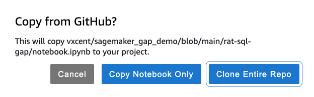

# sagemaker_gap_demo
## Check out the [notebook](rat-sql-gap/notebook.ipynb) to experiment with the text-to-SQL inference on Sagemaker Studio Lab

## When importing the notebook into Sagemaker Studio Lab, make sure the whole repo is cloned

